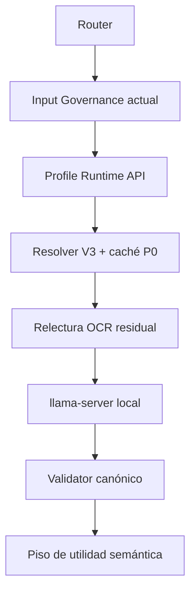

# LF Hetzner Profile Runtime API — candidato

API FastAPI persistente y deliberadamente acotada para consumir el `llama-server`
ya instalado en Hetzner. Escucha solo en loopback, usa un único worker y no instala,
descarga ni expone el modelo.

Estado vigente: `INSTALLED_NOT_INTEGRATED_PENDING_LIVE_REVERIFY`.

No se considera `READY` hasta ejecutar en el VPS vivo el mismo workload de Product
Director, validar el contrato canónico y completar la revisión de utilidad semántica
independiente. La API nunca autoriza downstream por sí sola.

## Flujo



En batch, `Resolver V3 + caché P0` se prepara una sola vez y se comparte entre
perfiles. La relectura es residual-only; el PNG completo no se envía al modelo por
defecto debido al OOM observado con Qwen y `parallel=1`.

## Endpoints

| Método | Ruta | Auth | Función |
|---|---|---:|---|
| `GET` | `/health` | No | Liveness mínima, sin detalles del modelo |
| `GET` | `/runtime` | Bearer | Estado de `llama-server`, caché, jobs y clasificación |
| `POST` | `/v1/profile/execute` | Bearer | Encola una ejecución idempotente por `request_id` |
| `POST` | `/v1/profile/batch` | Bearer | Encola hasta 8 perfiles con un solo context pack |
| `GET` | `/v1/jobs/{id}` | Bearer | Lee estado y resultado persistido en SQLite |

Los `POST` responden `202`. Reusar el mismo ID con bytes diferentes devuelve `409`.
Los jobs que queden incompletos tras un reinicio se recuperan como `FAILED`, nunca
como éxito implícito.

Cada resultado conserva gates independientes:

| Gate | Qué prueba | Qué no prueba |
|---|---|---|
| `runtime_completion` | Transporte, completion y attestation readback | Contrato o calidad |
| `profile_contract_valid` | JSON bare + schema canónico + validator del perfil | Utilidad semántica |
| `semantic_utility` | Piso determinista de consumibilidad | Autoridad semántica independiente |

`downstream_authorized` permanece siempre en `false`. Los gates de contrato,
semántica y autorización están prohibidos dentro de la caché estructural.

## Contrato de entrada

El Router entrega:

- artefacto ligado a `image_sha256`, dimensiones y observaciones OCR;
- receipt de Input Governance con `current=true`, `ready=true` y
  `context_sha256` verificable;
- `profile_code`, `profile_slug`, rutas canónicas bajo `profiles/<slug>/` e
  `input_literal`;
- cápsulas LF opcionales ya ligadas por Router con `activation_source=ROUTER`.

El runtime auto-liga `runtime_output.schema.json` sin reserializar sus bytes. Si no
existe, combina de forma determinista todos los `*.schema.json` del perfil mediante
`anyOf`. Las rutas absolutas, escapes `..` y fuentes fuera del perfil fallan cerrado.

## Configuración

La referencia completa está en
[`deploy/profile-runtime-api.env.example`](deploy/profile-runtime-api.env.example).
Variables críticas:

- `PROFILE_RUNTIME_API_TOKEN`: secreto Bearer; obligatorio.
- `PROFILE_RUNTIME_API_HOST=127.0.0.1`: cualquier bind no-loopback se rechaza.
- `PROFILE_RUNTIME_LLAMA_BASE_URL=http://127.0.0.1:8080`: solo HTTP loopback.
- `PROFILE_RUNTIME_REPO_ROOT`: checkout desplegado con perfiles y runtime gobernado.
- `PROFILE_RUNTIME_STATE_DIR`: caché estructural y SQLite, modo `0700`.
- `PROFILE_RUNTIME_MAX_WORKERS=1`: el parser no permite aumentar concurrencia.
- `PROFILE_RUNTIME_ALLOW_MODEL_IMAGE=false`: mantener desactivado en este VPS.

El cliente usa `/health`, `/v1/models` y `/v1/chat/completions` de `llama-server`,
incluido `response_format.type=json_schema`, según la
[documentación oficial de llama.cpp](https://github.com/ggml-org/llama.cpp/blob/master/tools/server/README.md).

## Desarrollo y pruebas

```bash
cd services/profile_runtime_api
python3 -m venv .venv
.venv/bin/pip install -r requirements-dev.in
PYTHONPATH=. .venv/bin/python -m pytest
```

Sin las dependencias opcionales de integración, la suite `unittest` aún prueba
caché, currentness/hash, gates, reuse batch, scripts y unidad systemd; los tres casos
HTTP se ejecutan automáticamente cuando FastAPI/httpx/jsonschema están instalados.

## Inspección e instalación

`scripts/inspect_vps.sh` es un inventario de solo lectura (salvo su archivo temporal):
procesos/units, listeners loopback, health de puertos 8080/8090, Tesseract y rutas de
modelos. `scripts/install.sh` lo ejecuta antes de mutar el servicio; después crea un
release atómico, venv, usuario restringido, env `0600` y la unidad systemd. No arranca
ni habilita el servicio salvo con `--start`.

Handoff desde un PC, reemplazando `DEPLOY_USER` y `VPS_HOST`. `git archive`
transfiere exactamente el árbol committed ligado a `DEPLOY_SHA`:

```bash
DEPLOY_SHA="$(git rev-parse HEAD)"
git archive --format=tar "$DEPLOY_SHA" | ssh DEPLOY_USER@VPS_HOST "install -d ~/lf-profile-runtime-$DEPLOY_SHA && tar -xf - -C ~/lf-profile-runtime-$DEPLOY_SHA"
ssh DEPLOY_USER@VPS_HOST "sudo ~/lf-profile-runtime-$DEPLOY_SHA/services/profile_runtime_api/scripts/inspect_vps.sh"
ssh DEPLOY_USER@VPS_HOST "sudo ~/lf-profile-runtime-$DEPLOY_SHA/services/profile_runtime_api/scripts/install.sh --source-dir ~/lf-profile-runtime-$DEPLOY_SHA --source-sha $DEPLOY_SHA"
ssh -t DEPLOY_USER@VPS_HOST "sudoedit /etc/lf-profile-runtime-api.env && sudo systemctl enable lf-profile-runtime-api.service && sudo systemctl restart lf-profile-runtime-api.service && sudo bash -c 'set -a; . /etc/lf-profile-runtime-api.env; curl --retry 10 --retry-connrefused --retry-delay 1 -fsS http://127.0.0.1:8090/health; curl -fsS -H \"Authorization: Bearer \$PROFILE_RUNTIME_API_TOKEN\" http://127.0.0.1:8090/runtime'"
```

Esto instala un candidato, no declara integración ni `READY`.

## Benchmark fijo

El harness rechaza cualquier raster que no sea PNG `1600x1000` con SHA-256
`ee36e056038832e9efbd0a369ded22808614c0c9a3f8ea7766e22f739ecdb287`.
Requiere además las observaciones OCR y un receipt actual de Input Governance; no los
fabrica ni los regenera silenciosamente.

```bash
set -a; . /etc/lf-profile-runtime-api.env; set +a
/opt/lf-profile-runtime-api/venv/bin/python \
  /opt/lf-profile-runtime-api/current/services/profile_runtime_api/scripts/run_benchmark.py \
  --image /ruta/B2B_CARGA_001_HISTORIAL_DESKTOP_LIGHT_v0.1_CANDIDATO.png \
  --observations /ruta/observations-current.json \
  --governance-receipt /ruta/input-governance-current.json \
  --output /var/lib/lf-profile-runtime-api/benchmark-b2b-carga-001.json
```

El reporte conserva hashes de lineage, tiempos históricos, wall time de la API y los
tres gates por perfil. No convierte un completion `3/3` en utilidad semántica `3/3`.
